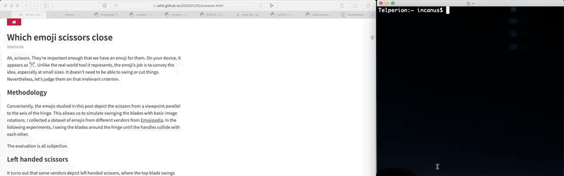

# fari

fari is a console application for quickly browsing, searching, and opening Safari tabs. I find it faster to navigate things with the keyboard, and fari is even faster than using Safari's built-in tab navigation shortcuts. 

If you care, it's written in Python 3 and should work out of the box on any modern Mac. 

## Screenshot

## Usage

Keystrokes are labeled in the application itself, but for reference: 

`0` through `9`: Open a tab from the current page

`<` & `>`: Page back/forward through tabs

`/`: Search all tabs (`<space>` to exit search, `Fn-Delete to backspace`)

`q`: Quit

`↑` & `↓`: Move through current page of tabs

`→`: Open currently moved-to tab

## Bugs & current quirks

- Only works on the first or main window of tabs (whatever Safari thinks that is). 
- Could be more resource-friendly; fari currently polls frequently to see if the tab count has changed in order to reload the view so that it's not stale.
- Related to the above, the view won't refresh if you merely rearrange tabs. 

## Future plans

- Fix the above bugs & quirks.
- Allow closing & rearrangement of tabs.
- Allow splitting & combining of windows. 
- Allow browsing, pulling from, and pushing to iCloud device tabs (i.e. other Safari instances of yours). 